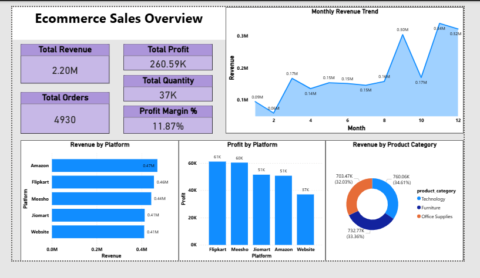
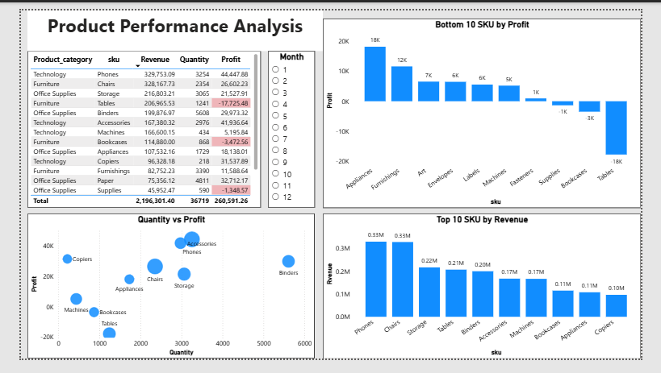

# E-commerce Sales & Customer Analytics using SQL, Python, and Power BI

## 📌 Project Overview

This project focuses on analyzing e-commerce sales data to identify trends in revenue, product performance, customer behavior, and profitability. 
The analysis was performed using Python for data cleaning and EDA, SQL for business queries, and Power BI for interactive dashboards to support data-driven decision-making.

---

---

🎯 Business Objectives

Understand overall sales and profit performance

Identify top and underperforming products

Analyze customer segments and purchasing behavior

Evaluate platform-wise performance

Study regional contribution to revenue

Highlight loss-making areas and improvement opportunities

---

📂 Dataset Information

The dataset contains transactional e-commerce sales records including:

Order ID, Order Date, Ship Date

Customer ID, Customer Type (Consumer, Corporate, Home Office)

SKU / Product Sub-Category, Product Category

Quantity, Revenue, Profit

Region, Ship Mode

---

🛠 Tools & Technologies

Python (Pandas, NumPy)

SQL (MySQL)

Power BI

Google Colab

---

🔄 Project Workflow

1. Data Cleaning and EDA using Python

2. Data exploration and feature understanding

3. SQL queries for business KPIs and insights

4. Power BI dashboard development

5. Insight generation and recommendations

---

📓 Python (Data Cleaning & EDA)

Handled missing values and data type issues

Verified date formats

Performed descriptive statistics

Checked revenue and profit distributions

Created derived columns where required

Notebook available in:

notebooks/data_cleaning_eda.ipynb

---

🧮 SQL Analysis

SQL was used to answer key business questions:

Total sales, profit, quantity, and orders

Monthly sales trends

Sales and profit by category, region, and segment

Top customers and top-selling products

Products with negative profit

Discount impact analysis

Repeat and low-frequency customers

Shipping mode performance

All queries are available in:

sql_queries.sql

---

📊 Power BI Dashboard

The dashboard contains three main pages:

1️⃣ Ecommerce Sales Overview

Total Revenue
Total Profit,
Profit Margin %,
Total Orders,
Total Quantity,
Monthly Revenue Trend,
Revenue by Platform,
Profit by Platform,
Revenue by Product Category

2️⃣ Product Performance Analysis

Top 10 SKUs by Revenue,
Bottom 10 SKUs by Profit, 
Quantity vs Profit Scatter Plot, 
Product Category vs SKU Performance Table

3️⃣ Customer Analytics

Total Customers, 
Revenue by Customer Type, 
Customer Type Distribution, 
Top 10 Customers by Revenue, 
Region Distribution by Customer Count, 
Region Distribution by Revenue

##  Power BI Dashboard

### Ecommerce Sales Overview

### Product Performance Analysis

### Customer Analytics

---

📈 Key Insights

Technology category contributes the highest revenue share

Furniture category contains multiple loss-making sub-categories

Phones and Chairs are top revenue-generating SKUs

Tables and Bookcases show negative profitability

Consumer segment contributes the largest share of revenue

West and East regions generate the highest revenue

Some SKUs have high quantity sold but low or negative profit

Platform-wise revenue is fairly balanced across marketplaces

---

💡 Business Recommendations

Focus marketing and inventory planning on high-profit categories (Technology)

Review pricing and discount strategy for Furniture products

Reduce excessive discounting on low-margin SKUs

Improve strategy in underperforming regions

Promote high-performing SKUs across platforms

---
✅ Conclusion

This project demonstrates the complete analytics lifecycle from raw data to business insights using Python, SQL, and Power BI. It reflects real-world analytical thinking and problem-solving skills required for entry-level data analyst roles.

